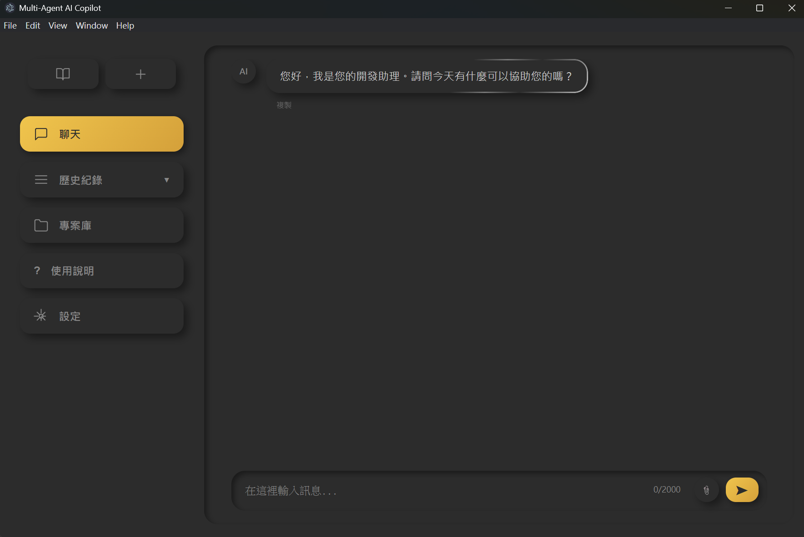
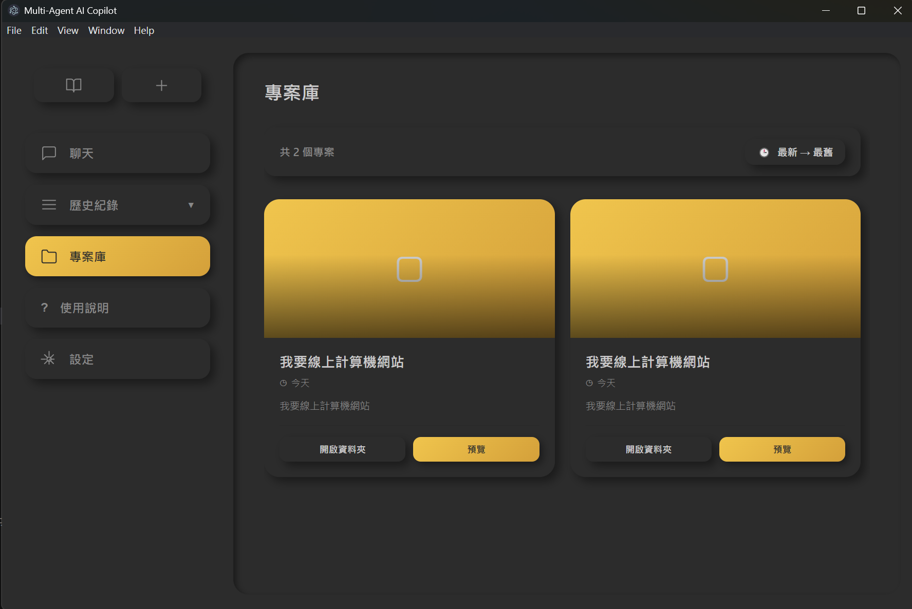
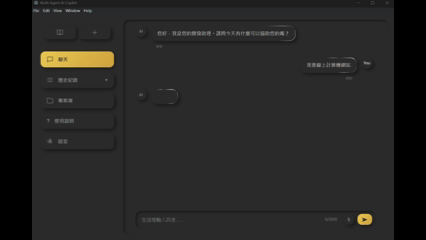
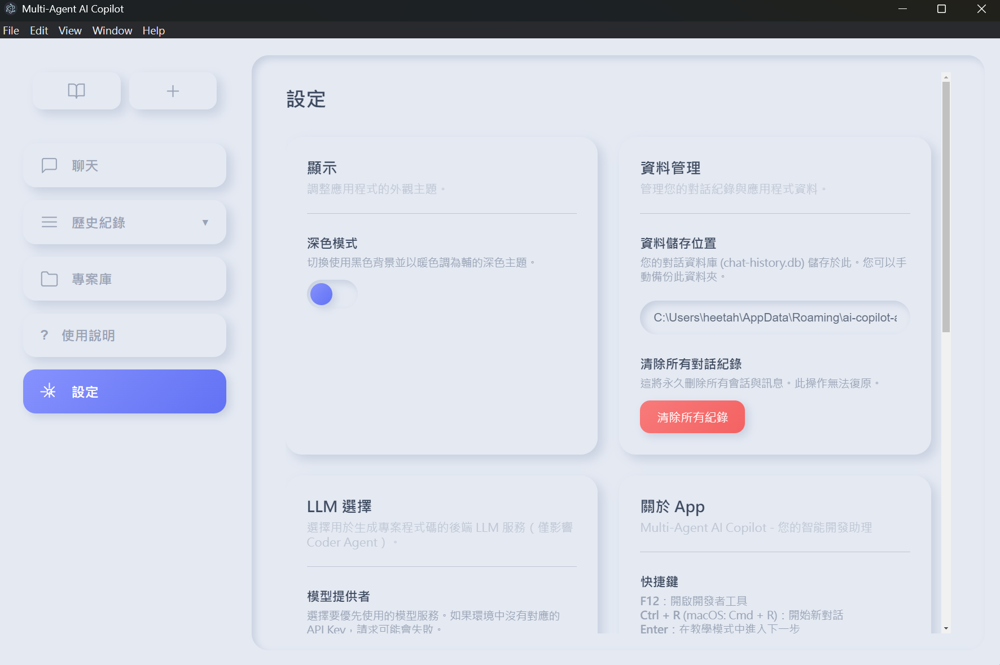

#  Multi-Agent AI Copilot

> 一個由大型語言模型驅動的智能專案生成系統，採用多代理架構自動化完成從需求分析到程式碼生成的完整流程。


##  功能特色

- **多代理協作** - 四個專業 AI 代理分工合作，各司其職
- **Neumorphism UI** - 優雅的新擬態設計，支援深色/淺色主題
- **一鍵生成** - 從需求描述到完整專案，全自動化生成
- **智能測試** - 自動生成測試計劃並執行驗證
- **項目管理** - 內建專案庫，管理所有生成的專案
- **多 API 支援** - 支援 OpenAI 和 Gemini，自動故障轉移

## 界面預覽

應用程式採用現代化的 Neumorphism 設計風格，配合 SVG 圖標系統，提供優雅且直觀的使用體驗。

### 應用程式演示

<table>
  <tr>
    <td width="50%">
      
      <p align="center"><b>智能對話介面</b></p>
    </td>
    <td width="50%">
      
      <p align="center"><b>專案庫管理</b></p>
    </td>
  </tr>
  <tr>
    <td width="50%">
      
      <p align="center"><b>程式碼生成過程</b></p>
    </td>
    <td width="50%">
      
      <p align="center"><b>設定與配置</b></p>
    </td>
  </tr>
</table>

### 主要特色
- **新手教學** - 互動式教學系統，快速上手
- **智能對話** - 自然語言描述需求即可
- **專案庫** - 卡片式佈局，輕鬆管理歷史專案
- **靈活設定** - 自訂 API、模型、溫度等參數

## 系統架構

### 核心代理

系統由四個核心 AI 代理組成，協同完成專案生成：

```
┌─────────────────┐
│  Architect      │  分析需求，生成系統架構
│  Agent          │  輸出: architecture.json
└────────┬────────┘
         ↓
┌─────────────────┐
│  Coder          │  根據架構生成程式碼
│  Coordinator    │  輸出: 完整專案檔案
└────────┬────────┘
         ↓
┌─────────────────┐
│  Verifier       │  生成測試計劃
│  Agent          │  輸出: xxx_testplan.md、verify_report.md
└────────┬────────┘
         ↓
┌─────────────────┐
│  Tester         │  執行測試並生成報告
│  Agent          │  輸出: xxx.test.js、test_report.md
└─────────────────┘
```

### 1. **Architect Agent** - 架構設計師
- **分析用戶需求並生成系統架構**
- **輸出結構化的 `architecture.json`**
- **包含完整的程式碼生成指令**

### 2. **Coder Coordinator** - 程式碼協調器
- **根據架構指令生成實際專案檔案**
- **支援多種專案類型和技術棧**
- **協調多個 Worker Agent 完成代碼生成**

### 3. **Verifier Agent** - 驗證代理
- **分析架構並確認檔案皆存在**
- **過濾 JS 檔案**
- **分析 JS 檔案特徵並輸出對應的 `xxx_testplan.md`**
- **統整並輸出`verify_report.md`**

### 4. **Tester Agent** - 測試代理
- **讀取測試計劃並建立映射關係**
- **修補源碼(避免修改Coder agent產生的檔案)**
- **生成對應的測試檔案`xxx.test.js`**
- **設置 Jest 配置**
- **自動執行測試**
- **生成報告`test_report.md`**

## 專案結構

```
Software_Engineering/
├── dev_page/                    # Electron 前端介面
│   ├── icons/                      # SVG 圖標庫
│   │   ├── info.svg               # 資訊圖標
│   │   ├── refresh.svg            # 刷新圖標
│   │   └── ...                    # 其他圖標
│   ├── icons.css                  # 圖標樣式系統
│   ├── icon-helper.js             # 圖標輔助函數
│   ├── main-window.html           # 主視窗 HTML
│   ├── main-window.js             # 渲染器進程腳本
│   └── style.css                  # Neumorphism 樣式
│
├── agents/                      # 多代理系統核心
│   ├── architect-agent.js         # 架構代理
│   ├── verifier-agent.js          # 驗證代理
│   ├── tester-agent.js            # 測試代理
│   ├── instruction-service.js     # 會話管理服務
│   ├── project-writer.js          # 專案檔案寫入器
│   ├── jest-prompt-template.js    # 提示模板中心
│   │
│   ├── coder-agent/               # 程式碼生成代理
│   │   ├── coordinator.cjs        # Coder 協調器
│   │   ├── config-generator.js    # 配置生成器
│   │   └── processor.js           # 檔案處理器
│   │
│   ├── worker-agents/             # 工作代理集合
│   │   ├── markup-agent/          # HTML/Markdown 生成
│   │   ├── script-agent/          # JavaScript 生成
│   │   ├── style-agent/           # CSS/SCSS 生成
│   │   ├── python-agent/          # Python 代碼生成
│   │   └── system-agent/          # 系統檔案生成
│   │
│   └── shared/                    # 共用模組
│       ├── api-standards.cjs      # API 標準規範
│       ├── errors.js              # 錯誤定義
│       └── logger.js              # 日誌記錄器
│
├── utils/                       # 工具模組
│   ├── api-provider-manager.js    # API 提供者管理
│   ├── config.js                  # 配置管理
│   ├── error-handler.js           # 錯誤處理
│   └── token-tracker.js           # Token 追蹤器
│
├── data/                        # 資料儲存
│   └── sessions/                  # 會話資料
│       └── <sessionId>/           # 每個會話的獨立目錄
│           ├── architecture.json  # 專案架構
│           ├── __tests__/         # 生成的測試檔案
│           ├── patched/           # 源碼修補完的檔案
│           ├── xxx_testplan.md    # 各檔案的測試計畫
│           ├── verify_report.md   # 驗證報告
│           └── test_report.md     # 測試報告
│
├── output/                      # 生成的專案輸出
│   └── <sessionId>/               # 每個會話生成的專案
│
├── Coordinator.js                 # 主協調器
└── main.js                        # Electron 主程式
```

## 快速開始

### 環境需求

- Node.js >= 18.0.0
- npm 或 yarn

### 安裝

```bash
# 克隆專案
git clone https://github.com/yourusername/multi-agent-copilot.git
cd multi-agent-copilot

# 安裝依賴
npm install
```

### 配置

建立 `.env` 檔案並配置 API 金鑰：

```env
# OPENAI_API_KEY=your_openai_api_key
# GOOGLE_API_KEY=your_google_api_key
```

### 啟動應用

```bash
# 啟動 Electron 應用程式
npm start
```

### 使用方式

1. **輸入需求** - 在聊天介面中用自然語言描述您的專案需求
   ```
   例如：「生成一個計算機網站，要有加減乘除功能」
   ```

2. **查看進度** - 實時查看各個代理的執行狀態
   - Architect Agent 執行中...
   - Coder Agent 準備配置...
   - Verifier Agent 執行中...

3. **下載專案** - 生成完成後，點擊下載按鈕獲取壓縮檔

4. **管理專案** - 在專案庫中查看、預覽、管理所有生成的專案

## UI 設計特色

### Neumorphism 風格

應用程式採用新擬態（Neumorphism）設計風格：

- **柔和陰影** - 營造立體感和深度
- **幾何簡潔** - 清晰的形狀和佈局
- **微互動** - 細膩的懸停和點擊效果
- **雙主題** - 支援淺色和深色模式

### SVG 圖標系統

統一的圖標設計語言：

- 可縮放矢量圖形，任何解析度都清晰
- CSS 可控顏色，完美適配主題
- 簡潔線條風格，符合 Neumorphism 美學
- 內嵌 SVG，無需額外載入時間

## 資料格式

### architecture.json

架構代理生成的專案架構：

```json
{
  "id": "session-id",
  "createdAt": "2025-12-13T06:00:00.000Z",
  "prompt": "生成計算機網站",
  "output": {
    "coder_instructions": {
      "role": "Coder Agent",
      "summary": "建立一個簡單的計算機網站",
      "directives": ["使用 HTML5", "CSS3 樣式", "原生 JavaScript"],
      "files": [
        {"path": "index.html", "description": "主頁面"},
        {"path": "style.css", "description": "樣式表"},
        {"path": "script.js", "description": "計算邏輯"}
      ]
    }
  }
}
```

## 🔧 進階使用

### 命令列執行

```bash
node Coordinator.js "生成待辦事項應用程式"
```

### 程式化呼叫

```javascript
import { runWithInstructionService, initializeAgents } from './Coordinator.js';

const agents = initializeAgents();
const plan = await runWithInstructionService("生成計算機網站", agents);
console.log(`Session ID: ${plan.id}`);
```

### 自訂代理溫度

不同代理使用不同的溫度參數：

- **Architect**: 0.3 - 保持創意但結構化
- **Coder**: 0.2 - 精確的程式碼生成
- **Tester**: 0.1 - 嚴格的測試邏輯

可透過 `.env` 檔案調整。

## 測試支援

### 測試類型

1. **函數測試** - 直接測試函數邏輯
   ```javascript
   const result = Calculator(5, 3, "+");
   expect(result).toBe(8);
   ```

2. **HTTP 測試** - 使用 supertest 測試 API
   ```javascript
   const res = await request(app).post("/api/calculate").send({...});
   expect(res.status).toBe(200);
   ```

### 測試層級

- **單元測試 (unit)** - 測試單一模組
- **整合測試 (integration)** - 測試模組互動
- **端對端測試 (e2e)** - 測試完整流程

## 錯誤處理

多層錯誤處理機制：

1. **API 層級** - 自動重試和故障轉移
2. **代理層級** - 統一錯誤格式和日誌
3. **協調器層級** - 用戶友好的錯誤訊息

### 錯誤類型

- `CoordinatorError` - 協調器錯誤
- `AgentError` - 代理執行錯誤
- `APIError` - API 呼叫錯誤

## 效能優化

### API 配置

- **超時**: 20 秒（可調整）
- **重試**: 2 次
- **延遲**: 500ms

### API 優先順序

自動優先使用 Gemini API，若不可用則切換至 OpenAI API。

## 開發指南

### 新增代理

1. 建立類別，繼承 `BaseAgent`
2. 實作必要方法
3. 在 `Coordinator.js` 註冊

### 擴展模板

在 `agents/templates.js` 添加新模板(目前暫停使用此方法)

### 自訂配置

透過 `.env` 或 `utils/config.js` 調整系統行為。

---

